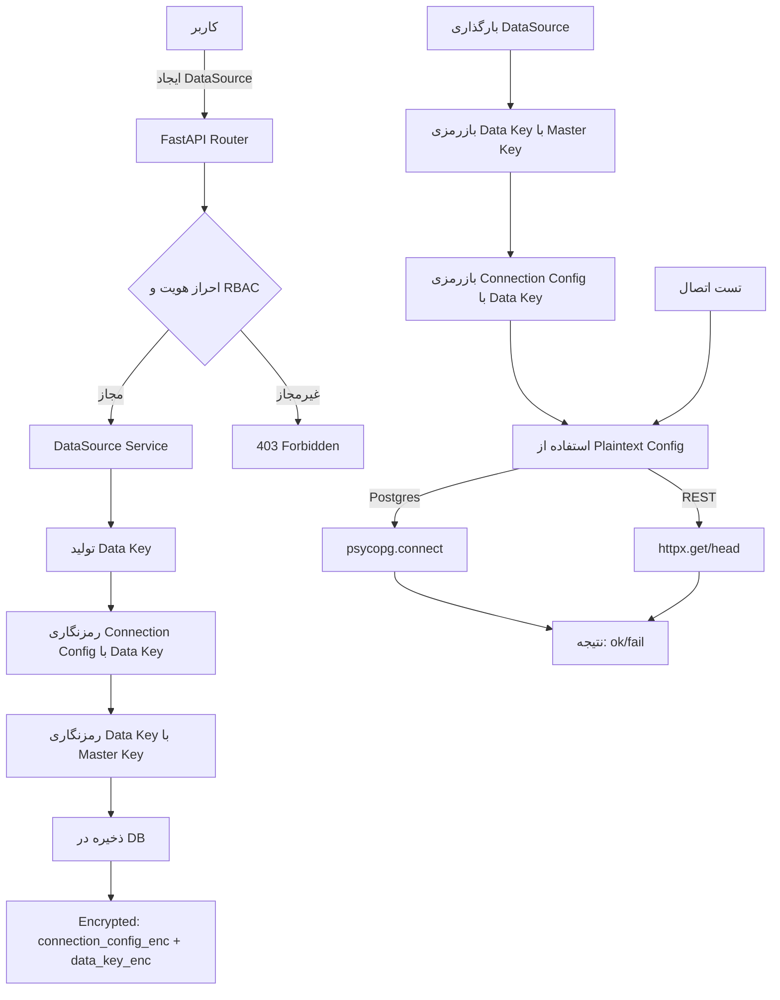
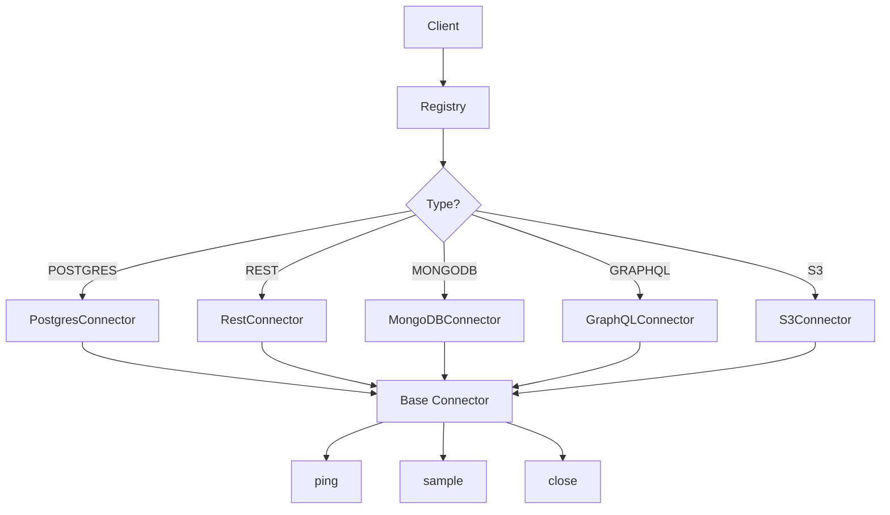
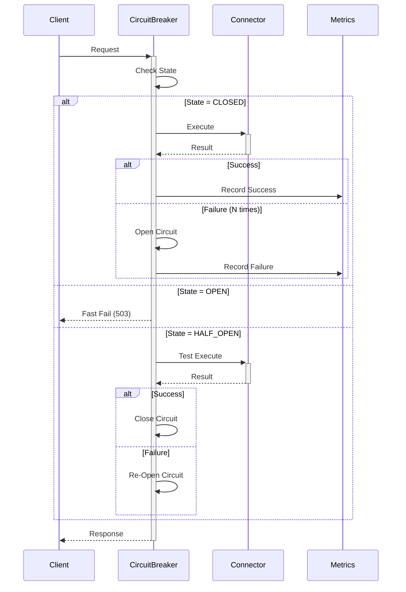
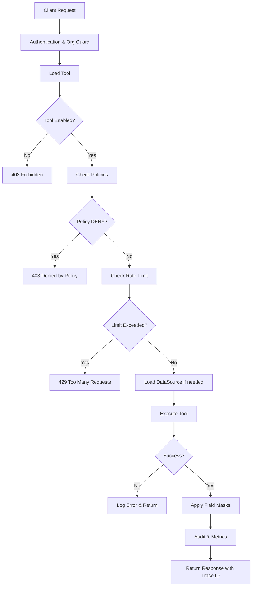

# معماری Farda MCP

## نمای کلی

Farda MCP یک سامانه چندمستأجری (Multi-tenant) مبتنی بر پروتکل MCP است که با معماری مونو‌ریپو پیاده‌سازی شده است.

## نمودار معماری سطح‌بالا

```
┌─────────────────────────────────────────────────────────┐
│                      کاربر نهایی                         │
└────────────────────┬────────────────────────────────────┘
                     │
                     ▼
┌─────────────────────────────────────────────────────────┐
│                    Nginx (Reverse Proxy)                 │
│                   پورت 8080                              │
└────────┬───────────────────────────────────────┬────────┘
         │                                       │
         │ /api/*                                │ /*
         ▼                                       ▼
┌─────────────────────┐              ┌──────────────────────┐
│   Backend (FastAPI) │              │   Web (Next.js)      │
│   پورت 8000         │              │   پورت 3000          │
│                     │              │                      │
│  • REST API         │              │  • App Router        │
│  • MCP Protocol     │              │  • RTL Support       │
│  • Authentication   │◄─────────────│  • Jalali Date       │
│  • Multi-tenancy    │   API Calls  │  • Dashboard         │
└──────────┬──────────┘              └──────────────────────┘
           │
           ▼
┌─────────────────────┐
│  PostgreSQL 16      │
│  پورت 5432          │
│                     │
│  • Tenant Data      │
│  • User Data        │
│  • Audit Logs       │
└─────────────────────┘
```

## لایه‌های معماری

### ۱. لایه ارائه (Presentation Layer)

**فرانت‌اند (Next.js 15)**
* **مسیر**: `web/`
* **مسئولیت**: رابط کاربری، تجربه کاربری، راست‌به‌چپ
* **تکنولوژی**: Next.js 15 (App Router), React 19, TypeScript, Tailwind CSS

**ویژگی‌های کلیدی**:
* پشتیبانی کامل RTL
* تقویم جلالی
* Server-side rendering (SSR)
* Static generation (SSG)
* API routes برای BFF pattern

### ۲. لایه منطق تجاری (Business Logic Layer)

**بک‌اند (FastAPI)**
* **مسیر**: `backend/apps/core/`
* **مسئولیت**: منطق تجاری، پردازش داده، احراز هویت
* **تکنولوژی**: FastAPI, Pydantic v2, SQLAlchemy 2

**ماژول‌های اصلی**:
* `config.py` - مدیریت تنظیمات با Pydantic Settings
* `db.py` - مدیریت اتصال دیتابیس (Async)
* `security.py` - امنیت و رمزنگاری
* `auth.py` - احراز هویت و RBAC (رزرو شده)
* `deps.py` - وابستگی‌های مشترک
* `routers/` - API endpoints

### ۳. لایه داده (Data Layer)

**دیتابیس (PostgreSQL 16)**
* **مسیر**: سرویس `db` در Docker Compose
* **مسئولیت**: ذخیره‌سازی پایدار داده‌ها
* **تکنولوژی**: PostgreSQL 16 با Async driver (asyncpg)

**مدیریت Schema**:
* Alembic برای migration ها
* SQLAlchemy 2 ORM
* Async queries

## ماژول‌های سیستم

### Backend Modules

```
backend/
  apps/
    core/              # هسته اصلی برنامه
      models/          # مدل‌های دیتابیس (SQLAlchemy)
      schemas/         # Pydantic schemas برای validation
      routers/         # API endpoints
        health.py      # Health check و version
    mcp/              # پروتکل MCP
    connectors/       # سیستم کانکتورها
      base.py          # Interface انتزاعی
      registry.py      # ثبت و ساخت کانکتورها
      resilience.py    # Retry/Backoff/Circuit-Breaker
      metrics.py       # سیستم متریک‌ها
      impl_*.py        # پیاده‌سازی کانکتورها
      service.py       # منطق تجاری
      router.py        # API endpoints
  tests/              # تست‌های واحد و یکپارچگی
  alembic/            # Database migrations
```

### Web Modules

```
web/
  app/
    (auth)/           # گروه Route برای احراز هویت
      signin/         # صفحه ورود
    dashboard/        # داشبورد اصلی
    api/              # API Routes (BFF)
      health/         # Health check
    layout.tsx        # Layout اصلی با RTL
    page.tsx          # صفحه خانه
  components/         # کامپوننت‌های قابل استفاده مجدد
  lib/                # توابع کمکی
    api.ts            # کلاینت API
    i18n.ts           # ترجمه و بین‌المللی‌سازی
    jalali.ts         # تقویم جلالی
```

## جریان داده (Data Flow)

### درخواست معمولی API

```
کاربر → Next.js (SSR/Client) → Nginx → FastAPI → PostgreSQL
                                  ↓
                            Response ← ─ ─ ─ ─ ┘
```

### احراز هویت (پرامپت ۲)

```
کاربر → صفحه Login → POST /api/auth/login → FastAPI
                                                ↓
                                          Validate credentials
                                                ↓
                                          Generate JWT Token
                                                ↓
                                          Return token ← ─ ─
                                                         ↓
کاربر ← Cookie/LocalStorage ← ─ ─ ─ ─ ─ ─ ─ ─ ─ ─ ─ ─ ┘
```

### مدیریت DataSource و Envelope Encryption (پرامپت ۳)



#### فلو Envelope Encryption

**۱. ایجاد DataSource:**
```
ورودی از کاربر → JSON config
   ↓
تولید Data Key (32 bytes random)
   ↓
رمزنگاری config با Data Key (AES-GCM)
   ↓
رمزنگاری Data Key با Master Key (از ENV)
   ↓
ذخیره در DB: connection_config_enc, data_key_enc
```

**۲. بارگذاری و استفاده:**
```
خواندن از DB: connection_config_enc, data_key_enc
   ↓
بازرمزی Data Key با Master Key
   ↓
بازرمزی connection_config با Data Key
   ↓
استفاده از config در تست اتصال یا کانکتور
```

**امنیت:**
* Master Key از متغیر محیطی `SECRETS_MASTER_KEY` خوانده می‌شود
* هیچ Endpoint یا لاگ اسرار را نمایش نمی‌دهد
* در MVP: Master Key از ENV، در V1: Vault/KMS
* فیلدهای حساس در UI ماسک شده (`•••••`)

## مرزبندی و جداسازی (Boundaries)

### مرزهای ماژولی

1. **Frontend ↔ Backend**: تنها از طریق REST API
2. **Backend ↔ Database**: تنها از طریق SQLAlchemy ORM
3. **Modules**: هر ماژول مسئولیت مشخص دارد (SRP)

### اصول جداسازی

* **No direct DB access from frontend**
* **No business logic in frontend** (except validation)
* **Clear API contracts** با Pydantic schemas
* **Async by default** در backend

## امنیت (Security Boundaries)

```
┌─────────────────────────────────────────┐
│          DMZ (Nginx)                    │
│  • Rate limiting                        │
│  • SSL termination                      │
│  • Header security                      │
└────────────┬────────────────────────────┘
             │
┌────────────▼────────────────────────────┐
│     Application Layer (FastAPI)         │
│  • Authentication (JWT/OIDC)            │
│  • Authorization (RBAC)                 │
│  • Input validation (Pydantic)          │
│  • SQL injection prevention (ORM)       │
└────────────┬────────────────────────────┘
             │
┌────────────▼────────────────────────────┐
│        Data Layer (PostgreSQL)          │
│  • Encrypted at rest                    │
│  • Row-level security (future)          │
│  • Audit logging                        │
└─────────────────────────────────────────┘
```

## Connector Abstraction & Registry

### معماری کانکتورها

سیستم Connectors با استفاده از الگوی **Factory** و **Strategy** پیاده‌سازی شده است:



**Base Interface:**
```python
class Connector(ABC):
    async def ping() -> tuple[bool, str]
    async def sample(params: dict) -> Any
    async def close() -> None
```

**Registry:**
- مدیریت متمرکز کانکتورها
- ساخت دینامیک بر اساس نوع
- Dependency Injection برای config

### Resilience Patterns

**۱. Retry با Exponential Backoff:**
- تلاش مجدد برای خطاهای شبکه‌ای
- تأخیر نمایی بین تلاش‌ها
- حداکثر تعداد تلاش و تأخیر قابل تنظیم

**۲. Circuit Breaker:**
```
States: CLOSED → OPEN → HALF_OPEN → CLOSED
         (normal) (failing) (testing) (recovered)
```

**جریان Circuit Breaker:**


**پارامترهای پیش‌فرض:**
- `failure_threshold`: 5 خطا
- `timeout_seconds`: 30 ثانیه
- `success_threshold` در HALF_OPEN: 2

### Metrics & Monitoring

**متریک‌های DataSource:**
- `calls_total`: تعداد کل فراخوانی‌ها
- `errors_total`: تعداد خطاها
- `avg_latency_ms`: میانگین تأخیر (EMA)
- `p95_ms`: تأخیر P95 (تقریبی)
- `last_ok_ts`: زمان آخرین اتصال موفق
- `last_err_ts`: زمان آخرین خطا
- `state`: وضعیت Circuit Breaker

**Endpoints:**
- `GET /orgs/{org_id}/datasources/{ds_id}/metrics`
- `GET /orgs/{org_id}/datasources/health`
- `POST /orgs/{org_id}/datasources/{ds_id}/ping`
- `POST /orgs/{org_id}/datasources/{ds_id}/sample`

## الگوهای طراحی (Design Patterns)

### Backend

* **Repository Pattern**: جداسازی منطق دسترسی به داده
* **Dependency Injection**: با استفاده از FastAPI Depends
* **Factory Pattern**: `create_app()` برای ساخت application و `make_connector()` برای کانکتورها
* **Settings Pattern**: مدیریت تنظیمات با Pydantic
* **Strategy Pattern**: کانکتورهای مختلف با interface یکسان
* **Circuit Breaker Pattern**: مدیریت خطاهای شبکه
* **Retry Pattern**: تلاش مجدد با Exponential Backoff

### Frontend

* **Component Composition**: کامپوننت‌های قابل استفاده مجدد
* **Server Components**: استفاده از RSC در Next.js
* **BFF Pattern**: API routes به‌عنوان Backend for Frontend
* **Layout Pattern**: استفاده از nested layouts

## مقیاس‌پذیری (Scalability)

### افقی (Horizontal)

* **Stateless backend**: قابل scale با load balancer
* **Database pooling**: اتصالات کارآمد به دیتابیس
* **Async I/O**: پشتیبانی از concurrent requests

### عمودی (Vertical)

* **Indexed queries**: برای عملکرد بهتر دیتابیس
* **Caching layers**: آماده برای Redis (پرامپت بعدی)
* **CDN ready**: فایل‌های استاتیک Next.js

## مانیتورینگ و Observability

### Logs

* **Structured logging**: JSON format
* **Log levels**: DEBUG, INFO, WARNING, ERROR
* **Request ID tracking**: برای trace کردن

### Metrics (آینده)

* **Health checks**: `/healthz` در backend و web
* **Performance metrics**: response time, throughput
* **Business metrics**: user activity, tenant usage

### Tracing (آینده)

* **Distributed tracing**: OpenTelemetry
* **Database query tracing**: SQLAlchemy events

## توسعه و تست

### محیط‌های اجرایی

1. **Local**: Docker Compose برای توسعه
2. **CI**: GitHub Actions برای تست خودکار
3. **Production**: (آینده) Kubernetes/Cloud

### استراتژی تست

* **Unit Tests**: pytest برای backend, Jest برای web
* **Integration Tests**: TestClient برای API
* **E2E Tests**: (آینده) Playwright

## محدودیت‌ها و Trade-offs

### فعلی

* **No Redis**: کش و صف در پرامپت‌های بعدی
* **Simple auth**: احراز هویت کامل در پرامپت ۲
* **Single DB**: چندمستأجری منطقی (نه فیزیکی)

### آینده

* **Add Redis**: برای caching و background jobs
* **Add message queue**: برای async processing
* **Add CDC**: برای event-driven architecture

## مراجع

* [FastAPI Documentation](https://fastapi.tiangolo.com/)
* [Next.js Documentation](https://nextjs.org/docs)
* [SQLAlchemy 2.0](https://docs.sqlalchemy.org/en/20/)
* [MCP Protocol Specification](https://modelcontextprotocol.io/)

## MCP Manager and Tool Invoke Pipeline

### Overview

The MCP Manager is a comprehensive system for managing executable tools that can be invoked through a secure pipeline with policy enforcement, rate limiting, audit logging, and field masking capabilities.

### Components

#### 1. Tool Registry
- **Tool Model**: Stores tool definitions with type (POSTGRES_QUERY, REST_CALL, CUSTOM), input/output schemas, and execution configuration
- **Execution Config**: JSON-based configuration that varies by tool type:
  - POSTGRES_QUERY: `query_template` with parameterized queries (no arbitrary SQL)
  - REST_CALL: `method`, `path`, `timeout_ms`
  - CUSTOM: Custom handler (MVP: simple echo)

#### 2. MCP Server Management
- **API Key Generation**: Secure random API keys (bcrypt hashed)
- **One-Time Display**: API keys shown only on create/rotate operations
- **Status Control**: Enable/disable servers independently

#### 3. Policy Engine
- **Policy Types**: ALLOW/DENY with role-based conditions
- **Field Masking**: Remove sensitive fields from responses (e.g., `{"remove": ["phone", "ssn"]}`)
- **Resource Types**: TOOL and DATASOURCE policies

#### 4. Rate Limiting
- **Token Bucket Algorithm**: Per-tool rate limiting (in-memory for MVP)
- **Configurable Limits**: Per-tool `rate_limit_per_min` or org-level defaults
- **429 Response**: Persian error message on limit exceeded

#### 5. Audit & Metrics
- **Trace ID**: Unique identifier for each invocation
- **Logging**: Actor, org, tool, result, latency, timestamp
- **Metrics**: Total calls, errors, p50/p95 latency (in-memory counters)

### Tool Invocation Pipeline



### Security Measures

1. **No Arbitrary SQL**: POSTGRES_QUERY tools use parameterized templates only
2. **Bound Parameters**: All query parameters are validated and bound safely
3. **One-Time Key Display**: MCP Server API keys shown only once (create/rotate)
4. **Policy Enforcement**: All invocations checked against org policies
5. **Audit Trail**: Complete logging of all invocations with trace IDs

### Performance Considerations

- **In-Process Execution**: ASGI-based, no external process spawning
- **Connection Pooling**: DataSource connections managed efficiently
- **Rate Limiting**: Prevents abuse and ensures fair usage
- **Field Masking**: Applied post-execution to minimize overhead

### MVP Limitations (Production Improvements)

1. **Rate Limiter**: Currently in-memory; migrate to Redis for distributed systems
2. **Metrics**: In-memory counters; migrate to Prometheus/StatsD
3. **Audit Log**: Logging to stdout; migrate to dedicated audit table/service
4. **REST_CALL**: Basic implementation; add retry, circuit breaker in V1

